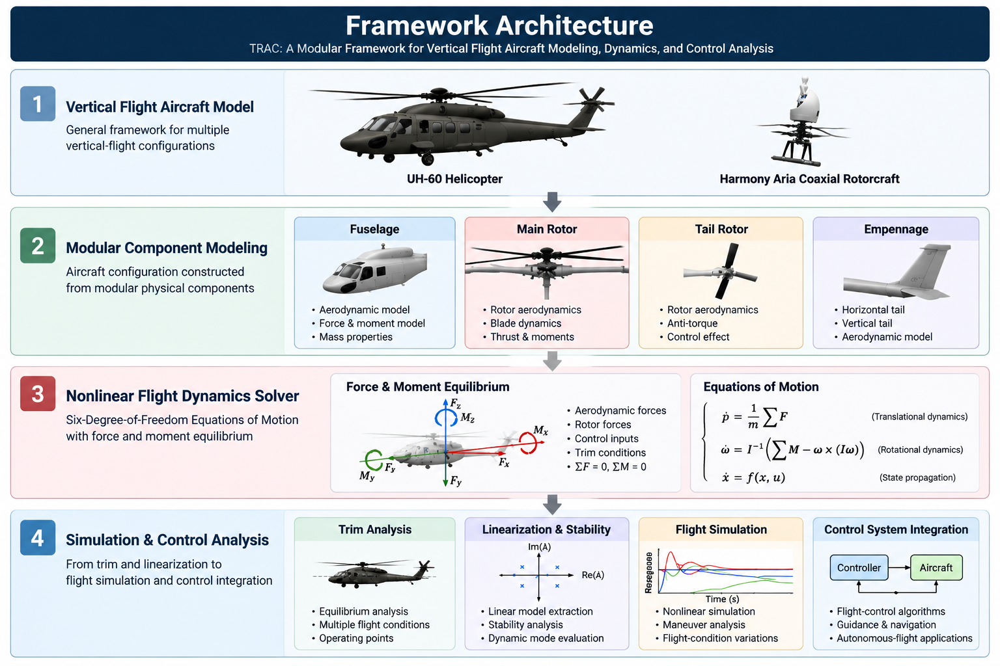

<p align="center">
  
</p>

<h1 align="center">
TRAC
</h1>

<h3 align="center">
Texas A&M University Rotorcraft Analysis Code
</h3>

<p align="center">
<strong>
A Modular Vertical Flight Aircraft Dynamics Modeling and Simulation Framework
</strong>
</p>

---

# Overview

TRAC (Texas A&M University Rotorcraft Analysis Code) is a modular vertical flight aircraft dynamics modeling and simulation framework developed by Bochan Lee.

The framework was developed to provide a flexible computational environment for physics-based modeling, nonlinear flight dynamics analysis, trim computation, linear model extraction, and flight simulation of rotorcraft and emerging vertical-flight aircraft configurations.

Rather than being limited to a specific aircraft model, TRAC was designed with a modular architecture that enables individual aircraft components and configurations to be independently modeled, modified, and integrated into complete flight-dynamics systems.

The framework provides a foundation for research involving:

- conventional rotorcraft
- coaxial rotorcraft
- advanced vertical-flight aircraft
- autonomous flight systems

---

# Research Motivation

The increasing complexity of modern vertical-flight aircraft requires simulation frameworks capable of representing diverse aircraft configurations while maintaining sufficient physical fidelity for flight-dynamics analysis and control-system development.

TRAC was developed to bridge the gap between conceptual aircraft modeling and high-fidelity flight simulation by integrating:

- physics-based aircraft modeling
- nonlinear six-degree-of-freedom dynamics
- component-level aerodynamic representation
- control-oriented model extraction
- simulation-based validation

The framework enables investigation of aircraft behavior from early-stage configuration studies to advanced flight-control and autonomous-flight applications.

---

# Framework Architecture

<p align="center">
  
</p>

TRAC represents a vertical flight aircraft as an integration of modular physical components.

The framework is designed around a component-based architecture, where individual aircraft elements are independently modeled and integrated into a complete nonlinear flight-dynamics system.

The modular architecture allows individual components to be modified, replaced, or extended without reconstructing the complete aircraft model.

This approach enables TRAC to support various vertical-flight aircraft configurations while maintaining a consistent modeling and simulation framework.

The framework consists of several major components:

- aircraft configuration and geometry definition
- aerodynamic component modeling
- rotor aerodynamic modeling
- nonlinear six-degree-of-freedom equations of motion
- numerical integration and flight simulation
- control-system interface

This structure provides a scalable foundation for investigating conventional rotorcraft, coaxial rotorcraft, and future vertical-flight aircraft configurations.

---

# Core Capabilities

TRAC integrates aircraft modeling, nonlinear flight dynamics, and simulation capabilities into a unified computational framework for vertical-flight aircraft research.

The major capabilities of TRAC include:

| Category | Capability |
|---|---|
| Aircraft Modeling | Modular representation of aircraft components and configurations |
| Rotorcraft Modeling | Main rotor, tail rotor, and rotor aerodynamic modeling |
| Aerodynamics | Component-level force and moment calculation |
| Flight Dynamics | Nonlinear six-degree-of-freedom aircraft equations of motion |
| Trim Analysis | Equilibrium analysis for multiple flight conditions |
| Linearization | Extraction of control-oriented linear aircraft models |
| Stability Analysis | Dynamic mode and eigenvalue analysis |
| Flight Simulation | Nonlinear aircraft response simulation |
| Control Integration | Interface for flight-control system development |
| Validation | Comparison with experimental flight-test data |

---

## Modular Aircraft Modeling

TRAC enables aircraft configurations to be constructed through independent physical components.

Major modeling elements include:

- fuselage aerodynamic representation
- main rotor system
- tail rotor system
- horizontal and vertical empennage
- aircraft mass and inertial properties

This modular approach allows new aircraft configurations to be developed by modifying or replacing individual components without redesigning the complete simulation framework.

---

## Flight Dynamics Analysis

TRAC provides nonlinear aircraft dynamics analysis based on six-degree-of-freedom equations of motion.

The framework supports:

- aircraft state propagation
- force and moment calculation
- dynamic response analysis
- flight-condition evaluation

The nonlinear dynamics model provides the foundation for trim analysis, linearization, control-system design, and autonomous-flight simulation.

---

## Control-Oriented Modeling

TRAC provides capabilities for extracting aircraft models suitable for flight-control development.

Supported analysis includes:

- trim condition calculation
- nonlinear-to-linear model conversion
- stability analysis
- dynamic mode evaluation

These capabilities enable integration between physics-based aircraft modeling and advanced flight-control research.

---

## Simulation and Validation

TRAC provides a simulation environment for evaluating aircraft performance and dynamic behavior.

Applications include:

- flight maneuver simulation
- control-system evaluation
- autonomous-flight simulation
- comparison with experimental flight data

Through validation against UH-60 flight-test data, TRAC demonstrates the ability to reproduce key vertical-flight aircraft characteristics while maintaining a flexible and extensible architecture.

---

# Aircraft Modeling Capability

TRAC was developed as a general vertical-flight aircraft modeling framework rather than an aircraft-specific simulation tool.

The framework is designed to represent different aircraft configurations by combining modular physical components, aerodynamic models, and flight-dynamics formulations within a unified simulation architecture.

This approach enables TRAC to support research ranging from conventional helicopter analysis to emerging vertical-flight aircraft concepts.

---

# Demonstrated Aircraft Configurations

## UH-60 Helicopter

The UH-60 helicopter was selected as the baseline configuration for the development and validation of the TRAC framework.

The UH-60 model incorporates:

- fuselage aerodynamic representation
- main rotor aerodynamic model
- tail rotor aerodynamic model
- horizontal and vertical empennage models
- nonlinear six-degree-of-freedom aircraft dynamics

The UH-60 configuration provided a comprehensive validation platform for evaluating the accuracy and robustness of the TRAC framework.

The model was validated through comparison with available U.S. Army UH-60 flight-test data, demonstrating the capability of TRAC to reproduce key helicopter flight characteristics.

---

## Harmony Aria Coaxial Rotorcraft

TRAC was further extended to model Harmony Aria, a compact coaxial electric rotorcraft developed for advanced personal air vehicle research.

The implementation of a coaxial rotorcraft configuration demonstrated the flexibility of the TRAC architecture beyond conventional single-main-rotor helicopters.

This extension required adaptation of the aircraft representation to accommodate different rotor-system characteristics while maintaining the overall modeling and simulation framework.

The successful modeling of Harmony Aria demonstrated the capability of TRAC to support diverse vertical-flight aircraft configurations.

---

# Future Aircraft Modeling Directions

The modular architecture of TRAC provides a foundation for future expansion toward additional vertical-flight aircraft configurations.

Future research directions include:

- multi-configuration rotorcraft modeling
- variable-fidelity aircraft models
- advanced VTOL aircraft configurations
- emerging eVTOL concepts
- novel rotor and propulsion architectures

The long-term objective is to establish TRAC as an extensible computational framework capable of supporting aircraft studies from conceptual design through flight-dynamics analysis, control development, and autonomous-flight applications.

---

# Flight Dynamics Analysis

## Trim Analysis

TRAC provides equilibrium analysis capabilities for multiple vertical-flight aircraft operating conditions.

Supported trim conditions include:

- hover
- forward flight
- climb
- descent
- coordinated turning flight

Trim solutions provide operating points for subsequent dynamic analysis, linear model extraction, and flight-control system development.

---

## Linear Model Extraction

The nonlinear aircraft model can be linearized around selected operating conditions.

Extracted linear models enable:

- stability analysis
- dynamic mode evaluation
- control-system design
- aircraft response prediction

The linearization capability allows TRAC to bridge nonlinear aircraft simulation and control-oriented analysis.

---

## Flight Simulation

The nonlinear simulation environment enables analysis of:

- aircraft dynamic response
- control input effects
- maneuver characteristics
- flight-condition variations
- autonomous-flight scenarios

TRAC provides a unified environment where aircraft modeling, dynamics analysis, and control-system development can be evaluated together.

# Validation

The UH-60 helicopter model was used as the primary validation platform for the TRAC framework.

Validation was performed through comparison with available U.S. Army UH-60 flight-test data.

Validation parameters include:

- aircraft attitude response
- rotor response characteristics
- power requirements
- control inputs

The validation demonstrated that TRAC can reproduce important helicopter flight characteristics while maintaining a modular architecture suitable for future aircraft configurations.

# Application: Autonomous Flight Simulation

TRAC provides the aircraft dynamics foundation for advanced autonomous-flight research.

The framework has been integrated with:

- flight-control algorithms
- guidance and navigation systems
- vision-based autonomous systems

One demonstrated application is autonomous vertical-flight aircraft ship-landing simulation.

```mermaid
flowchart LR

A["Aircraft<br/>Modeling"]
-->
B["Flight Dynamics<br/>Simulation"]
-->
C["Guidance &<br/>Control"]
-->
D["Vision-Based<br/>Navigation"]
-->
E["Autonomous<br/>Landing"]

The integration demonstrates how physics-based aircraft modeling can support complete autonomous vertical-flight system development.

# Sample Code

Selected examples will be provided to demonstrate the implementation and application of TRAC.

Examples include:

- aircraft model configuration
- trim analysis
- linear model extraction
- flight simulation
- control-system integration

The complete source code is not currently publicly released.

Technical documentation, validation results, selected implementations, and demonstration examples will be progressively released.

# Repository Structure

TRAC-Vertical-Flight-Dynamics

```
├── README.md
│
├── assets
│   └── trac-overview.png
│
├── docs
│   ├── framework-overview.md
│   ├── mathematical-model.md
│   ├── rotor-modeling.md
│   ├── trim-analysis.md
│   └── validation.md
│
├── aircraft_models
│   ├── UH60
│   └── Harmony_Aria
│
├── sample_code
│   ├── trim_analysis
│   ├── linearization
│   └── simulation
│
├── results
│
└── publications
```

# Future Development

TRAC is continuously being extended as a research framework for next-generation vertical-flight systems.

Future research directions include:

- additional rotorcraft configurations
- variable-fidelity aircraft modeling
- advanced VTOL aircraft concepts
- emerging eVTOL configurations
- physics-based and AI-enhanced modeling approaches
- integration with intelligent autonomous flight systems

The long-term goal is to develop a flexible computational environment capable of supporting aircraft studies ranging from early conceptual design to advanced autonomous-flight applications.

# Publications

## Development and Validation of a Comprehensive Helicopter Flight Dynamics Code

AIAA SciTech Forum, 2020

Development and validation of TRAC using comprehensive UH-60 modeling and U.S. Army flight-test data.


## Development of "Aria," a Compact, Quiet Personal Electric Helicopter

Journal of the American Helicopter Society, 2023

Design, modeling, development, and flight testing of a compact coaxial electric personal air vehicle.

---

# Citation

If TRAC contributes to your research, please cite:

```bibtex
@inproceedings{lee2020trac,
  author={Bochan Lee},
  title={Development and Validation of a Comprehensive Helicopter Flight Dynamics Code},
  booktitle={AIAA SciTech Forum},
  year={2020}
}
```

---

# License

Documentation and selected examples are provided for research and educational purposes.
